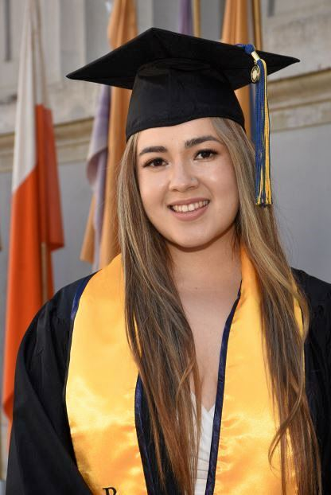

### INTRODUCTION

My name is Ashley Romo. I am a first-generation student at the Mailman School of Public Health in New York City. I am studying Epidemiology, and my certificate is in Applied Biostatistics and Data Science. I completed my Bachelor's of Arts at the University of California, Berkeley where I double majored in Public Health and Molecular and Cell Biology with a concentration in Neurobiology. 
 
 

### SUMMER INTERNSHIP
This summer I had the opportunity of completing my practicum at Columbia University, Mailman School of Public Health. I worked on the Database Shared Resource Project (DBSR), which is directed by Dr. Jeanine Genkinger. 

In October, I participated in [Epidemiology Masters Students Day](https://www.epidemiologymsd.com/) where I presented my [poster](https://www.epidemiologymsd.com/_files/ugd/1a4c4d_11b4cac6ca104550b38299c2508ca8a2.pdf) about my practicum. Although my practicum was completed in August 2023, I continue to work for DBSR. 

To see my previous experience, please view my [resume](about.html).
